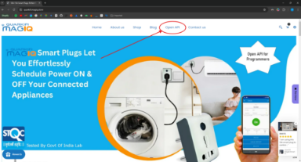
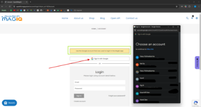
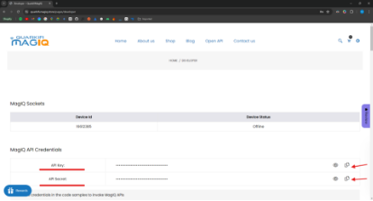
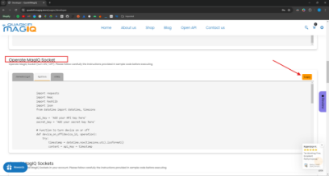
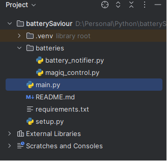
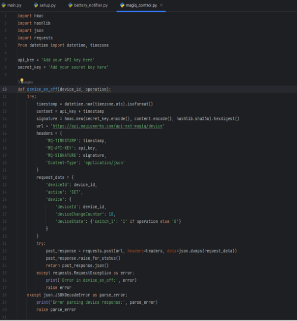
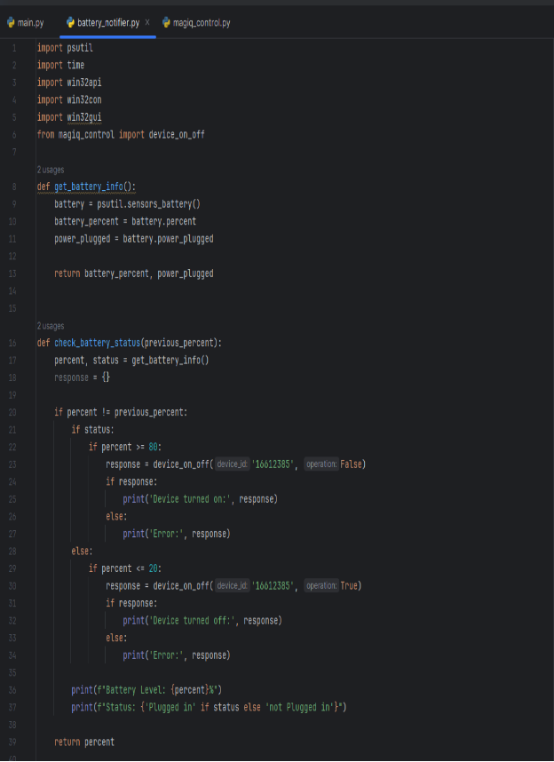
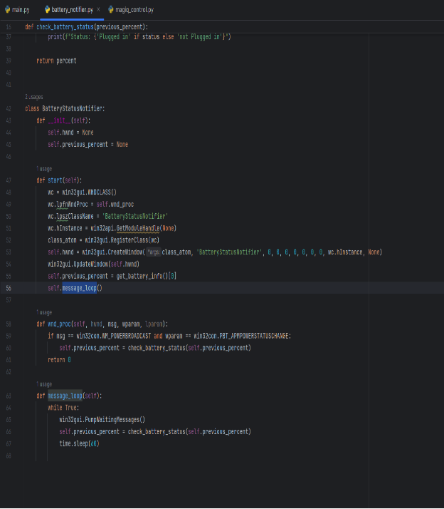
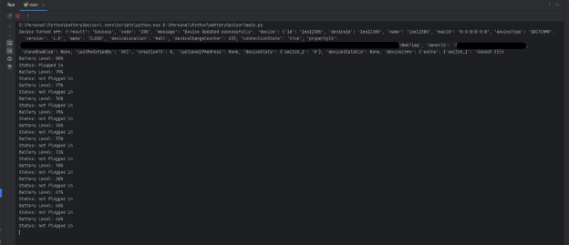

1. Go to the [magiq store](https://www.quarkifi.magiq.store/) 

        

1. Select Open API / Develop 

` `      

1. Login with Google account that was used to login in the MagIQ app

   

1. Copy and store API and Secret key 

   

1. Scroll down to the Operate MagIQ Socket and Select Python and copy the code

   
1. ### Project Structure
   ### 

1. ### **Requirements.txt**

1. ### **Install require libraries**

pip install requests pywin32

**OR**

pip install -r requirements.txt

1. #### ***magiq\_control.py***
This script defines a function to control devices using the MagIQ API.

**API Keys**:

- api\_key and secret\_key: These placeholders should be replaced with your actual API key and secret key obtained from MagIQ.

**Function: device\_on\_off(device\_id, operation)**: This function sends a command to turn a device on or off using the MagIQ API.

- **Parameters**:
  - device\_id: The unique identifier of the device you want to control.
  - operation: A value of '1' to turn the device on and '0' to turn it off.
- **Process**:
  1. **Generate Timestamp**: Creates a timestamp in UTC format.
  1. **Create Content String**: Combines the API key and timestamp to create a content string.
  1. **Generate HMAC Signature**: Uses the secret\_key and content string to generate a signature for the request.
  1. **Define URL and Headers**: Sets the endpoint URL and headers needed for the request, including the timestamp, API key, and signature.
  1. **Construct Request Data**: Prepares the JSON payload with the device ID, action, and desired device state.
  1. **Send HTTP Request**: Sends a POST request to the MagIQ API with the headers and request data.
  1. **Error Handling**: Catches and prints any request or JSON parsing errors.

- 
1. #### ***battery\_notifier.py***
This script defines a class to monitor the battery status and notify accordingly.

**Imports**:

- win32api, win32con, win32gui, and win32process: Used to interact with Windows API for monitoring power status changes.
- **Function: check\_battery\_status(previous\_percent)**: This function checks the current battery status and prints the battery level and whether it is plugged in or not.
- **Parameters**:
  - previous\_percent: The previous battery percentage to compare with the current one.
- **Process**:
  - **Get Current Battery Status**: Retrieves the current battery life percentage and AC line status.
  - **Print Battery Status**: Prints the battery level and whether it is plugged in or not.
  - **Return Current Percentage**: Returns the current battery percentage.

- 
1. #### ***Class: BatteryStatusNotifier*** 
` `This class sets up a notifier to monitor battery status changes and notify the user accordingly.

- **init(self)**: Initializes the class with self.hwnd (window handle) and self.previous\_percent (previous battery percentage) set to None.
- **start(self)**:
  - Registers a window class for handling power status changes.
  - Creates a window and updates it.
  - Checks the initial battery status and starts the message loop.
- **wnd\_proc(self, hwnd, msg, wparam, lparam)**:
  - Handles the power status change messages.
  - If a power status change is detected, it updates self.previous\_percent.
- **message\_loop(self)**:
  - Runs an infinite loop to check and update the battery status every 60 seconds continuously.

1. ### **Main.py**
   ### This script is the entry point for the battery notifier.
- **Main Block**:
  - Imports the BatteryStatusNotifier class from battery\_notifier.
  - Creates an instance of BatteryStatusNotifier and starts it.

1. ### **Run Main.py**
   ### Notify on battery percentage change and operate device when battery level off (80%) and on (20%).

