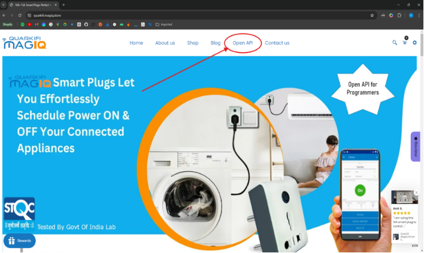
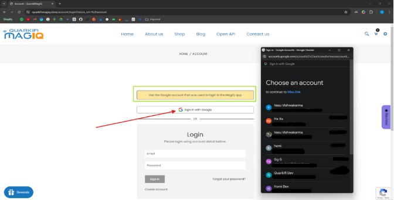
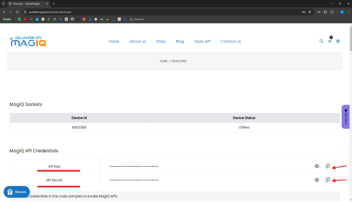
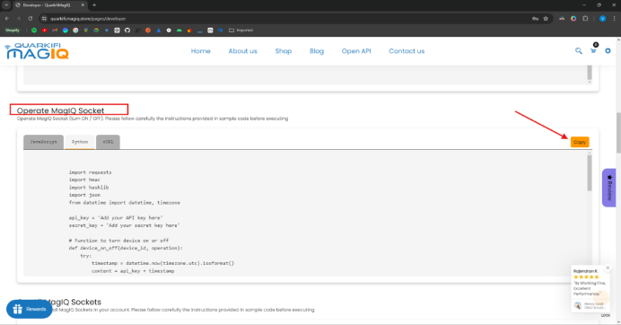

# Quarkifi MagIQ Smart Socket Cloud API Examples!

Explore this repo to find varioud ways one can invoke Quarkifi MagIQ cloud APIs and control the smart socket on various use cases and develop smart energy management solutions

To operate Quarkifi MagIQ Smart Socket using Cloud API one needs to procure the physical smart socket from the procurement site Quarkifi [MagIQ Store](https://www.quarkifi.magiq.store/)

     

1. Select Open API / Develop 

` `      

1. Login with Google account that was used to configure the Quarkifi MagIQ Smart Socket in the Android/iOS mobile APP

1. Copy and store API and Secret key 

1. Scroll down to the Operate Quarkifi MagIQ Socket and select Python and copy the code

All Examples then follow the same code as the reference to turn On or Off the Quarkifi MagIQ Smart Socket

