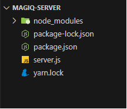
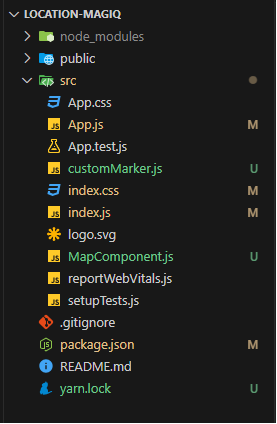
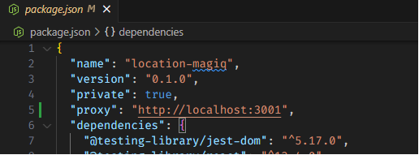
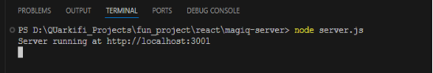
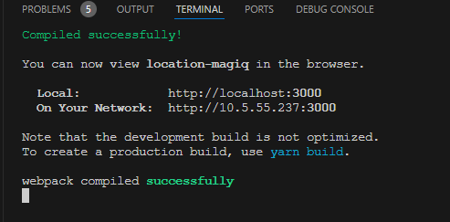
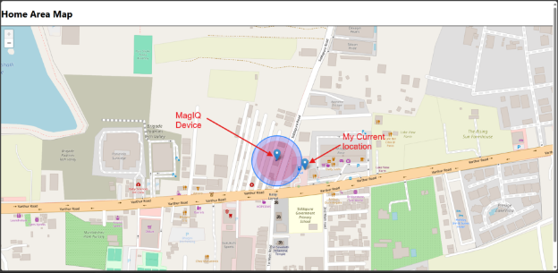

# GPS Location Based Socket Power Control

In this example GPS Location read and based on the location the socket is turned ON or OFF. Before starting make sure to retrieve the apikey and apisecret as mentioned in [Main](/)

#### Demo Video

1. ### Setup Web Server:

1. cd magiq-server
2. npm install

   Project Node Structure:

   

   Server.js:

   This code sets up an Express.js server with a single endpoint to turn a device on or off. It uses the axios library to make HTTP requests and the crypto library to generate HMAC signatures for secure API calls.

- **app**: Initializes an Express application.
- **port**: Sets the port for the server to listen on, either from an environment variable or defaulting to 3001.
- **apiKey** and **secretKey**: Credentials for authenticating with the external API.
- Uses Express middleware to automatically parse incoming JSON requests.

- **Endpoint**: Defines a POST endpoint at /api/device-on-off.
- **Request Body**: Extracts deviceId and operation from the request body.
- **requestData**: Prepares the data to be sent in the request.
- **timestamp**: Current timestamp in ISO format.
- **content**: Concatenation of apiKey and timestamp.
- **signature**: Generated using HMAC SHA-256 with secretKey and content.
- **serviceUrl**: URL of the external service API.
- **headers**: HTTP headers including the timestamp, API key, signature, and content type.
- **axios.post**: Sends the POST request to the external service with the requestData and headers.
- **app.listen**: Starts the Express server on the defined port.
- **Callback Function**: Logs a message to the console indicating the server is running and the port it's listening on.

2. ### Setup Web View :

1. cd location-magiq
2. npm install

   React Project Structure:

   

3. ### App.js:
- This component sets up the main structure of the application.
- It renders a header and the MapComponent which handles the map and location functionalities.

  MapComponent.js:

- **useState**: Manages the state of currentLocation and source.
- **useEffect**: Calculates the distance between the currentLocation and source whenever they change and makes a POST request to the server to turn the device on or off based on the distance.
- **LocationMarker**: A component that gets the user's current location and sets it in the state.
- **SourceMarker**: A component that allows the user to set a source location by clicking on the map. If the user clicks again on the source, it will reset the source location.
- **MapContainer**: Renders the map and includes the TileLayer, LocationMarker, and SourceMarker components.
4. ### CustomMarker.js:
- **DefaultIcon**: Configures the default icon for markers using Leaflet's icon configuration.
- **CustomMarker**: A component that renders a Leaflet Marker with the custom icon and optional click event handler.

  Index.js:

- The entry point for the React application.
- Renders the App component into the root DOM element.
- Imports global CSS files and Leaflet CSS.

  Index.css:

- **.leaflet-container**: Ensures the Leaflet map container takes up the full viewport height and width, providing a full-screen map experience.
5. ### Package.json:
**proxy**: Configures the development server to proxy API requests to http://localhost:3001, where the Express server is running. This allows the React application to make API requests without encountering CORS issues.

6. ### Run Project:
- Start Server:

  ` `

- Run react with npm start

  

