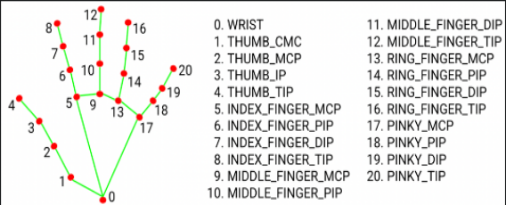

# Battery Level Based Socket Power Control

In this example hand gesture is read and based on the gesture the socket is turned ON or OFF. Before starting make sure to retrieve the apikey and apisecret as mentioned in [Main](/)

1. ### Project Structure

2. ### Install require libraries
pip install -r requirements.txt

3. ### magiq\_control.py
This script defines a function to control devices using the MagIQ API.

**API Keys**:

- api\_key and secret\_key: These placeholders should be replaced with your actual API key and secret key obtained from MagIQ.

**Function**:

- **get\_device(device\_id)**: Retrieves device information from the MagIQ API.

- **get\_device\_state(device\_id)**: Gets the current state of the device (on or off). 

- **device\_on\_off(device\_id, operation)**: This function sends a command to turn a device on or off using the MagIQ API.

- **Parameters**:
  - device\_id: The unique identifier of the device you want to control.
  - operation: A value of '1' to turn the device on and '0' to turn it off.
- **Process**:
  - **Generate Timestamp**: Creates a timestamp in UTC format.
  - **Create Content String**: Combines the API key and timestamp to create a content string.
  - **Generate HMAC Signature**: Uses the secret\_key and content string to generate a signature for the request.
  - **Define URL and Headers**: Sets the endpoint URL and headers needed for the request, including the timestamp, API key, and signature.
  - **Construct Request Data**: Prepares the JSON payload with the device ID, action, and desired device state.
  - **Send HTTP Request**: Sends a POST request to the MagIQ API with the headers and request data.
  - **Error Handling**: Catches and prints any request or JSON parsing errors.

4. ### Util.py
Contains utility functions for calculating angles and distances between [hand landmarks](https://ai.google.dev/edge/mediapipe/solutions/vision/gesture_recognizer).

- **get\_angle**: Calculates the angle between three points.

- **get\_distance**: Calculates the distance between two points and interpolates it to a scale of 0 to 1000.

1. ### main.py
This is the main script that handles image capture, gesture detection, and device control.

- **Imports**:
  - cv2: OpenCV for video capture and image processing.
  - mediapipe: For hand gesture detection.
  - time: For handling timing-related functions.
  - util: Contains utility functions for angle and distance calculations.
  - magiq\_control: Contains functions to control devices via a custom API.
- **Initialization**
  - Initializes MediaPipe's hands module.
  - Define various durations for gesture detection and message display.
  - Initializes global variables for gesture timing and messages.
  - Defines device IDs for the devices to be controlled.

5. ### Gesture Detection Functions
   - **gesture\_one**: Recognizes an “Index finger up” hand gesture based on the angles between fingertip and finger\_MCP  hand landmarks and the distance between the thumb and middle finger.

     

   - **gesture\_two**: Recognizes "Index and Middle up” hand gesture using similar logic but with different angle requirements.

     

6. ### Gesture Processing Function 

Detects gestures by analyzing hand landmarks and checks if the gesture duration is met to trigger the device control action.

1. ### Main function

The main function that captures video, processes frames, detects gestures, and controls devices based on the detected gestures.

- Captures video feed and processes frames to detect hand landmarks.

- Calls **detect\_gestures** to recognize gestures and triggers device **Toggle** actions accordingly.

- Displays messages on the video feed indicating the detected gesture and device control status.

