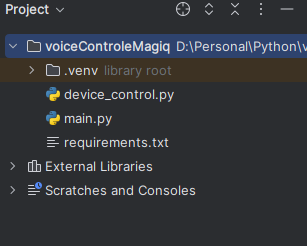
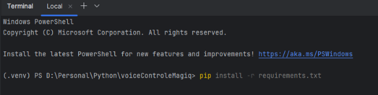
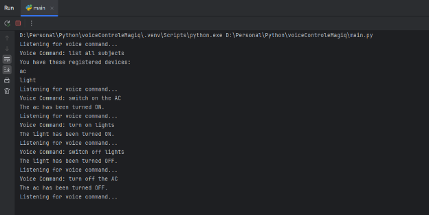

# Voice Command Based Socket Power Control

In this example Voice Command is interpreted and based on the command the socket is turned ON or OFF. Before starting make sure to retrieve the apikey and apisecret as mentioned in [Main](/)

#### Demo Video

1. ### Project Structure

1. ### Install required libraries
pip install -r requirements.txt

2. ### magiq\_control.py
This script defines a function to control devices using the MagIQ API.

**API Keys**:

- api\_key and secret\_key: These placeholders should be replaced with your actual API key and secret key obtained from MagIQ.

  **Function: device\_on\_off(device\_id, operation)**: This function sends a command to turn a device on or off using the MagIQ API.

- **Parameters**:
  - device\_id: The unique identifier of the device you want to control.
  - operation: A value of '1' to turn the device on and '0' to turn it off.
- **Process**:
  1. **Generate Timestamp**: Creates a timestamp in UTC format.
  1. **Create Content String**: Combines the API key and timestamp to create a content string.
  1. **Generate HMAC Signature**: Uses the secret\_key and content string to generate a signature for the request.
  1. **Define URL and Headers**: Sets the endpoint URL and headers needed for the request, including the timestamp, API key, and signature.
  1. **Construct Request Data**: Prepares the JSON payload with the device ID, action, and desired device state.
  1. **Send HTTP Request**: Sends a POST request to the MagIQ API with the headers and request data.
  1. **Error Handling**: Catches and prints any request or JSON parsing errors.
3. ### main.py
This module contains the main application logic for capturing and processing voice commands.

- **recognize\_voice\_command()**:

  This function captures and processes voice commands using the speech\_recognition library.

  - **Recognizer and Microphone:** Initializes the recognizer and microphone instances from speech\_recognition.
  - **Ambient Noise Adjustment:** Adjusts for ambient noise to improve recognition accuracy.
  - **Listening and Recognizing:** Captures audio from the microphone and recognizes it using Google’s speech recognition service.
  - **Error Handling:** Catches and prints errors related to unknown audio and request issues.
- **Main loop**

  The main loop continuously listens for voice commands and performs the device** 

  - **List:** Dictionary of device IDs and their corresponding names.
  - **Message:** String containing the list of registered devices.
  - **Main Loop:** Continuously listens for voice commands, processes them, and calls the appropriate function to control the device.
  - **Command Processing:** Identifies the action (turn on/off) and the device from the voice command.
  - **Response Handling:** Prints the response message based on the action performed.
4. ### Run main.py
- **Usage**
  - To list all registered devices, say list.
  - To turn on/off a specific device, say turn on <device name> or turn off <device name>.

    
