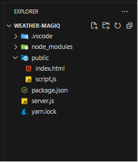

# Weather Value Based Socket Power Control

In this example Weather data is read and based on the data( temp/humidity) the socket is turned ON or OFF. Before starting make sure to retrieve the apikey and apisecret as mentioned in [Main](/)

1. In this example we would be using [Rapid API](https://rapidapi.com/hub) to get weather data and use that data to control Quarkifi MagIQ socket.

        

Once Weather API is configured
1. Select current weather with "lat” “lon”
2. Change target language to JavaScript
3. Test Endpoint to check API is working fine.

   We use this code to get the real-time weather info in server.js

   

   Project Structure:

   

   **Index.html**

   This HTML file is the front-end of the web application. It includes a weather status circle, input fields for manual coordinates, and dropdowns for temperature and humidity customization.

- **Weather Circle:** Displays the current weather status (cold, good, hot) along with temperature and humidity.
- **Input Fields:** Allow manual input of latitude and longitude.
- **Dropdowns:** Allow customization of hot temperature, low humidity limit, and high humidity limit.

**Script.js**

This JavaScript file contains the client-side logic to fetch weather data, update the UI, and control the AC device.

- **customizeTemperatures(dropdown):** Updates the hotTemp variable based on user selection.
- **getLocation():** Gets the user's current geolocation.
- **getWeather(lat, lon):** Fetches weather data from the server for the provided coordinates. 
- **updateWeatherCircle(temp, humidity):** Updates the weather circle and controls the AC device based on the current weather and humidity.
- **deviceOnOff(deviceId, operation):** Sends a request to the server to turn the AC device on or off.
- **init():** Initializes the application by getting the geolocation and fetching the weather data.
- **getWeatherFromInput():** Fetches weather data based on manually input coordinates.
- **generateTemperatureOptions():** Populates the temperature dropdown with options.
- **generateHumidityOptions():** Populates the humidity dropdowns with options.
- **customizeHumidityLimits():** Updates the humidity limit variables based on user selection.
- **setInterval():** if latitude and longitude is available then check weather in every 10 minute and operate device on whether change.

### **Server.js**
This Node.js file contains the server-side logic using Express.js to serve static files, fetch weather data from a third-party API, and handle device operations using the MagIQ API.

- api\_key and secret\_key: These placeholders in server.js should be replaced with your actual API key and secret key obtained from MagIQ.
- **deviceOnOff(deviceId, operation):** Sends a command to turn a device on or off using the MagIQ API.
- **Parameters:**
  - deviceId: The unique identifier of the device you want to control.
  - operation: A value of true to turn the device on and false to turn it off.
- **Process:**
  - Generate Timestamp: Creates a timestamp in UTC format.
  - Create Content String: Combines the API key and timestamp to create a content string.
  - Generate HMAC Signature: Uses the secretKey and content string to generate a signature for the request.
  - Define URL and Headers: Sets the endpoint URL and headers needed for the request, including the timestamp, API key, and signature.
  - Construct Request Data: Prepares the JSON payload with the device ID, action, and desired device state.
  - Send HTTP Request: Sends a POST request to the MagIQ API with the headers and request data.
  - Error Handling: Catches and prints any request or JSON parsing errors.
- **GET /api/weather/**

  Fetches weather data from “Open Weather” API for the provided latitude and longitude.

  - **Parameters:**
    - lat: Latitude of the location.
    - lon: Longitude of the location.
  - **Process:**
    - Construct API Request: Sets the URL and headers needed for the weather API request.
    - Send HTTP Request: Sends a GET request to the weather API.
    - Send Response: Returns the weather data as a JSON response.
    - Error Handling: Catches and prints any request errors, and returns an error response.
- **POST /api/device:** 

  Handles device operations by calling the deviceOnOff function.

  - **Parameters:**
    - deviceId: The unique identifier of the device you want to control.
    - operation: A value of true to turn the device on and false to turn it off.
  - **Process:**
    - Call deviceOnOff: Invokes the deviceOnOff function with the provided parameters.
    - Send Response: Returns the response from the MagIQ API.
    - Error Handling: Catches and prints any request errors, and returns an error response.
- **GET /**: Serves the main page (index.html).

  **Run server** 

- Run “node server.js” 
- Open browser and navigate to : http://localhost:3000

