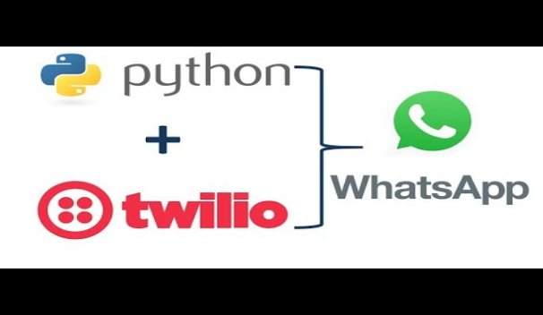
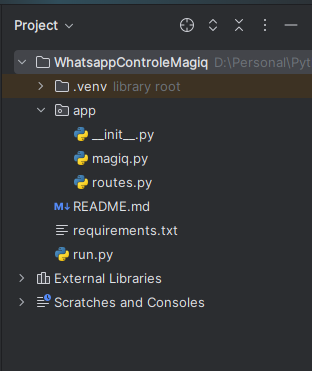
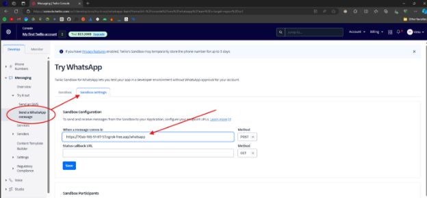

# WhatsApp Message Based Socket Power Control

In this example WhatsApp Message is read and based on the message the socket is turned ON or OFF. Before starting make sure to retrieve the apikey and apisecret as mentioned in [Main](/)

1. This example uses Twilio API to read and send WhatsApp messages. One needs to generate access keys for [Twilio](https://www.twilio.com/en-us/messaging/channels/whatsapp)

#### Demo Video

2. You need to have ngrok installed on your system. You can download it from [ngrok's official website](https://ngrok.com/). 

### Project Structure

### **Install require libraries**
pip install -r requirements.txt

#### ***magiq.py***
This script defines a function to control devices using the MagIQ API.

**API Keys**:

- api\_key and secret\_key: These placeholders should be replaced with your actual API key and secret key obtained from MagIQ.

**Function: device\_on\_off(device\_id, operation)**: This function sends a command to turn a device on or off using the MagIQ API.

- **Parameters**:
  - device\_id: The unique identifier of the device you want to control.
  - operation: A value of '1' to turn the device on and '0' to turn it off.
- **Process**:
  1. **Generate Timestamp**: Creates a timestamp in UTC format.
  2. **Create Content String**: Combines the API key and timestamp to create a content string.
  3. **Generate HMAC Signature**: Uses the secret\_key and content string to generate a signature for the request.
  4. **Define URL and Headers**: Sets the endpoint URL and headers needed for the request, including the timestamp, API key, and signature.
  5. **Construct Request Data**: Prepares the JSON payload with the device ID, action, and desired device state.
  6. **Send HTTP Request**: Sends a POST request to the MagIQ API with the headers and request data.
  7. **Error Handling**: Catches and prints any request or JSON parsing errors.
#### ***routes.py***
This script defines the Flask routes for handling WhatsApp messages. Here's the code.

- **Flask Route:** Defines a /whatsapp route to handle POST requests from Twilio.
- **Device IDs:** A dictionary mapping device names to their IDs.
- **Message Handling:** Parses the incoming message to determine the command (turn on, turn off, list) and the device (ac, light).
- **Response:** Sends a response message back to the user based on the command.

#### ***run.py***
` `This file is the entry point for running the Flask application. Here's the code

- **Run Flask App:** Starts the Flask application on port 5000.
- Here, 5000 is the port number your Flask application is running on. ngrok will output a forwarding URL.

- Note the https URL (https://<random-string>.ngrok.free.app). This is the public URL that will tunnel requests to your local server.

### **Configure Twilio**
Go to your Twilio console and navigate to your WhatsApp sandbox settings. Set the "WHEN A MESSAGE COMES IN" webhook to the ngrok URL followed by /whatsapp. And you good to go.

